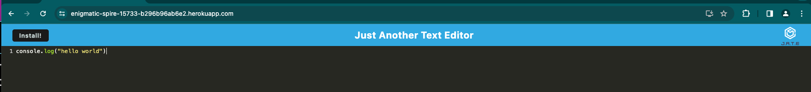
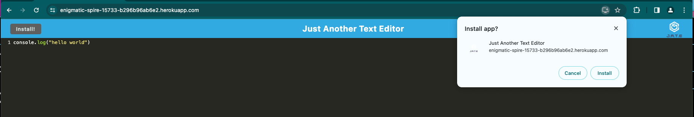

# text_editor

## Description

This is a simple text editor that comes with a webpackage installation so the app can work without internet connection. This project was meant to practice the application of PWAs in particular the webpack configuration. 

## Table of Contents (Optional)

- [Installation](#installation)
- [Usage](#usage)
- [Credits](#credits)
- [License](#license)

## Installation

In google chrome open the following app:

https://enigmatic-spire-15733-b296b96ab6e2.herokuapp.com

Either use it in the browser with internet connection or hit the install button and use it on your computer without internet.

## Usage

Type in your text in the text editor either on your browser or on your computer.

To install press the install button and accept:

## Credits

https://github.com/ArmanBarseghyan83/text-editor.git
https://webpack.js.org/guides/development/
https://webpack.js.org/contribute/writing-a-plugin/
https://www.youtube.com/watch?v=MpGLUVbqoYQ
https://www.youtube.com/watch?v=IZGNcSuwBZs
https://www.youtube.com/watch?v=1oflKrkwrLo
https://github.com/magickw/TextEditor
https://github.com/isayani/pwa-text-editor

## License

MIT
